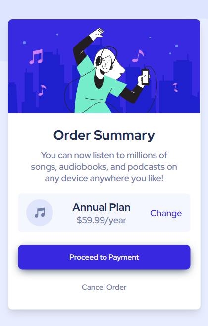
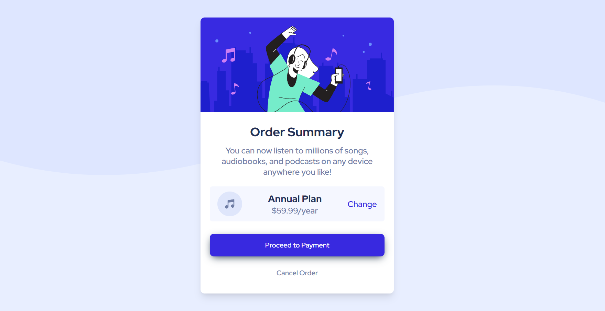
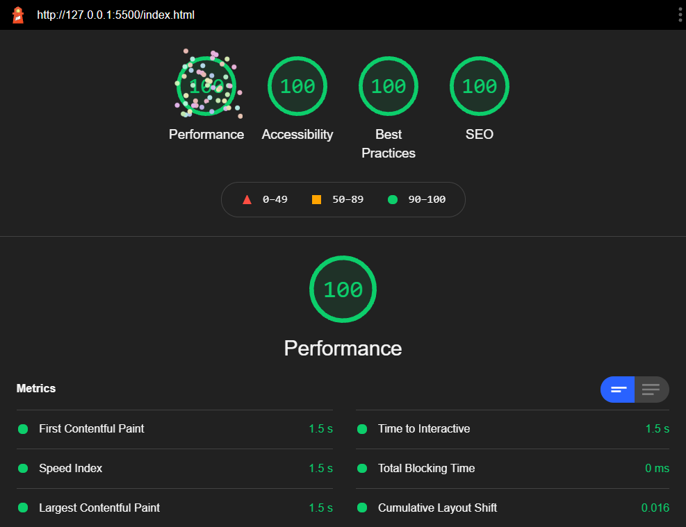

# Frontend Mentor - Order summary card solution

Hello my name is Ikhsan Fauji, and this is my solution to the [Order summary card challenge on Frontend Mentor](https://www.frontendmentor.io/challenges/order-summary-component-QlPmajDUj). Really interesting to do this challence because it has amazing design with clear user experience. I have to build out this order summary card component and get it looking as close to the design as possible even if I don't have the detail informations of the design because I use free account to solve this challenge.
## Table of contents

- [Overview](#overview)
  - [The challenge](#the-challenge)
  - [Screenshot](#screenshot)
  - [Links](#links)
- [My process](#my-process)
  - [Built with](#built-with)
  - [What I learned](#what-i-learned)
  - [Continued development](#continued-development)
  - [Useful resources](#useful-resources)
- [Author](#author)
- [Acknowledgments](#acknowledgments)

## Overview

### The challenge

Users should be able to:

- See hover states for interactive elements

### Screenshot

Mobile Preview


Desktop Preview


### Links

- Solution URL: [Add solution URL here](https://your-solution-url.com)
- Live Site URL: [Add live site URL here](https://your-live-site-url.com)

## My process


### Built with

- Semantic HTML5 markup
- CSS custom properties
- Flexbox
- Sass Style Preprocessor
- Mobile-first Workflow
- Accessibility Approach

### What I learned

Use this section to recap over some of your major learnings while working through this project. Writing these out and providing code samples of areas you want to highlight is a great way to reinforce your own knowledge.

To see how you can add code snippets, see below:

```html
<h1>Some HTML code I'm proud of</h1>
```
```css
.proud-of-this-css {
  color: papayawhip;
}
```
```js
const proudOfThisFunc = () => {
  console.log('🎉')
}
```

If you want more help with writing markdown, we'd recommend checking out [The Markdown Guide](https://www.markdownguide.org/) to learn more.

**Note: Delete this note and the content within this section and replace with your own learnings.**

### Continued development

Use this section to outline areas that you want to continue focusing on in future projects. These could be concepts you're still not completely comfortable with or techniques you found useful that you want to refine and perfect.

**Note: Delete this note and the content within this section and replace with your own plans for continued development.**

### Useful resources

- [SASS Documentation](https://sass-lang.com/documentation) - This site help me to setup and learn more about SASS Preprocessor.
- [Web.dev](https://web.dev/) - This site help me to solve problems about Fist Contentful Paint, Speed Index, Largest Contentful Paint, Time to Interactive, Total Blocking Time and Cumulative Layout Shift.
- [Lighthouse](https://chrome.google.com/webstore/detail/lighthouse/blipmdconlkpinefehnmjammfjpmpbjk?hl=id) This is chrome extension to help me reviews Performance, Accessability, Best Practice and SEO.


## Author

- Website - [Ikhsan Fauji](https://ikhsanfauji.vercel.app)
- Frontend Mentor - [@ikhsan-fauji](https://www.frontendmentor.io/profile/ikhsan-fauji)

## Acknowledgments

This is where you can give a hat tip to anyone who helped you out on this project. Perhaps you worked in a team or got some inspiration from someone else's solution. This is the perfect place to give them some credit.

**Note: Delete this note and edit this section's content as necessary. If you completed this challenge by yourself, feel free to delete this section entirely.**
