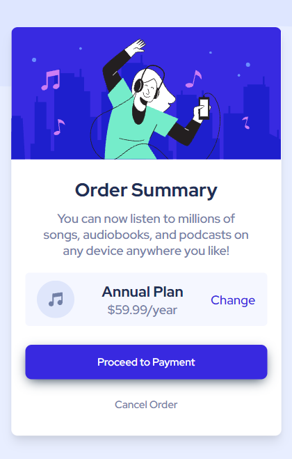
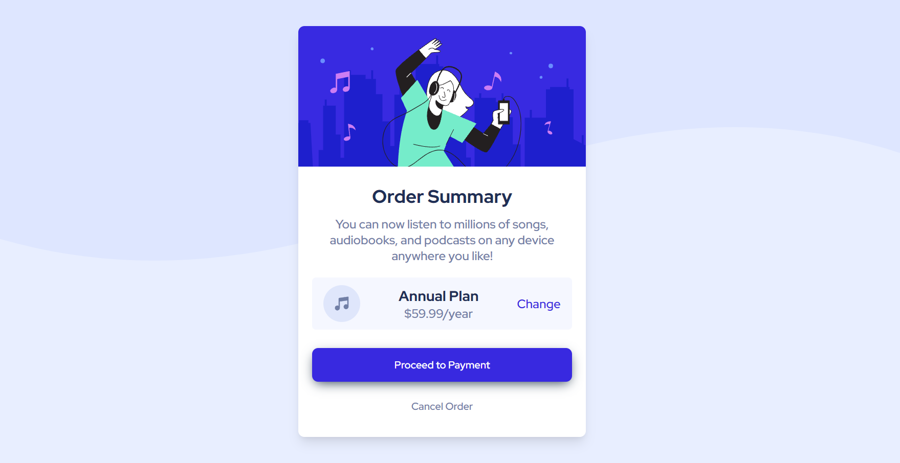

# Frontend Mentor - Order summary card solution

Hello my name is Ikhsan Fauji, and this is my solution to the [Order summary card challenge on Frontend Mentor](https://www.frontendmentor.io/challenges/order-summary-component-QlPmajDUj). Really interesting to do this challence because it has amazing design with clear user experience. I have to build out this order summary card component and get it looking as close to the design as possible even if I don't have the detail informations of the design because I use free account to solve this challenge.
## Table of contents

- [Overview](#overview)
  - [The challenge](#the-challenge)
  - [Screenshot](#screenshot)
  - [Links](#links)
- [My process](#my-process)
  - [Built with](#built-with)
  - [What I learned](#what-i-learned)
  - [Continued development](#continued-development)
  - [Useful resources](#useful-resources)
- [Author](#author)
- [Acknowledgments](#acknowledgments)

## Overview

### The challenge

Users should be able to:

- See hover states for interactive elements

### Screenshot

Mobile Preview


Desktop Preview


### Links

- Solution URL: [Add solution URL here](https://your-solution-url.com)
- Live Site URL: [Add live site URL here](https://your-live-site-url.com)

## My process


### Built with

- Semantic HTML5 markup
- CSS custom properties
- Flexbox
- Sass Style Preprocessor
- Mobile-first Workflow
- Accessibility Approach

### What I learned

In this challenge I keep in mind to setup the SASS style pre processor and create boz-shadow.

To see how you can add code snippets, see below:

```html
<article class="card">...</article>
```
```css
.card {
  box-shadow: rgba(0, 0, 0, 0.1) 0px 10px 15px -3px, rgba(0, 0, 0, 0.05) 0px 4px 6px -2px;
}
```
```js
"scripts": {
  "sass": "sass ./assets/sass/index.scss ./assets/css/style.css"
}
```

### Continued development

The first thing I wana do is learn more deep about css so that I can styling my html more easier.

### Useful resources

- [SASS Documentation](https://sass-lang.com/documentation) - This site help me to setup and learn more about SASS Preprocessor.
- [Web.dev](https://web.dev/) - This site help me to solve problems about Fist Contentful Paint, Speed Index, Largest Contentful Paint, Time to Interactive, Total Blocking Time and Cumulative Layout Shift.
- [Lighthouse](https://chrome.google.com/webstore/detail/lighthouse/blipmdconlkpinefehnmjammfjpmpbjk?hl=id) This is chrome extension to help me reviews Performance, Accessability, Best Practice and SEO.


## Author

- Website - [Ikhsan Fauji](https://ikhsanfauji.vercel.app)
- Frontend Mentor - [@ikhsan-fauji](https://www.frontendmentor.io/profile/ikhsan-fauji)
